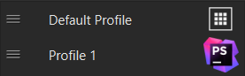

# Bug Report: "switchToProfile" event disables the Smart Profiles feature

This is a minimal reproduction repository for a bug regarding "switchToProfile" event - [https://developer.elgato.com/documentation/stream-deck/sdk/events-sent/#switchtoprofile](https://developer.elgato.com/documentation/stream-deck/sdk/events-sent/#switchtoprofile)

It contains a small Javascript plugin with a preconfigured profile and two actions that will be useful for demonstration purposes:

- **switchToProfile** action - emits "switchToProfile" event with "Preconfigured Profile" as the payload
- **switchToNull** action - emits "switchToProfile" event with "null" as the payload

## What are Smart Profiles

[https://help.elgato.com/hc/en-us/articles/360053419071-Elgato-Stream-Deck-Smart-Profiles](https://help.elgato.com/hc/en-us/articles/360053419071-Elgato-Stream-Deck-Smart-Profiles)

> A **Smart Profile** automatically switches the active profile on Stream Deck based on the program in focus.
>

## Short description of the bug

The bug causes the Smart Profiles functionality to stop working after a plugin sends a "switchToProfile" event with any payload.

## Reproduction Steps

Assuming Windows 10 and a clean installation of the Stream Deck app:

1. Configure Smart Profiles
    1. Create two profiles
    2. Open Preferences ⚙️ → Profiles
    3. Click on the first profile, then check "Make this my default profile"
    4. Click on the second profile, assign it to an application
    5. Close the Preferences  

2. Install this plugin
    1. Download [com.bug.switch-to-profile.streamDeckPlugin](./Release/com.bug.switch-to-profile.streamDeckPlugin) file and double-click to install it  
    
   
    2. Accept installing preconfigured profiles  
    
   
    3. You’ll see a new profile has been added called "Preconfigured Profile"

4. Place plugin’s action
    1. Search for "switchToProfile" key in the keys list on the right  
       
    2. Place it on one of your profiles created in step 1 (not on the preconfigured profile)

5. Ensure Smart Profile functionality is working
    1. Close the Stream Deck app (close - not quit, not minimize). It’s needed as Smart Profiles functionality does not work when the app is open, even when minimized to taskbar.  
       
    2. Start changing focus between the app you assigned to a profile on step 1.4, and your desktop or any other app (so that the default profile gets activated).
    3. Observe that profiles are switching as you change the focus (Smart Profiles are working).

6. Press the plugin's action button you placed on step 3; the "switchToProfile" event should be sent by plugin, resulting in switching to the plugin's bundled profile called "Preconfigured Profile". The plugin's bundled profile should be activated as expected.  

7. Smart Profiles feature no longer works. You can focus the app or desktop - the profile will stay the same.

## Reproduction Frequency

This bug can be reproduced consistently every time a plugin sends "switchToProfile" event.

## Expected Behavior

After a plugin sends a "switchToProfile" event and changes the currently active profile, changing focus from the currently focused application should activate the profile associated with the newly focused application.

## Actual Behavior

The Smart Profiles feature gets disabled (profiles no longer switch automatically when changing focus) after a plugin sends "switchToProfile" event, **even if the plugin specifies "null" as the payload.**

This causes inconvenience to users who have to manually enable the functionality every time a plugin attempts to switch to any, even non-existent, profile.

## Workaround

Unfortunately, there is no way for a plugin to "return control" over profiles to the Stream Deck app once a "switchToProfile" event has been triggered. If the plugin sends "switchToProfile" with "null" as the payload, the previously active profile gets activated as stated in documentation:

> If the `profile` field is missing or empty, the Stream Deck application will switch to the previously selected profile.
>

However, the Smart Profiles feature still does not begin to work even after that.

There are two ways to make Smart Profiles work again, but both require manual user action:

- open Stream Deck app, select a different profile, then close Stream Deck app.
- place a "Switch Profile" action from the "Navigation" category on the plugin’s preconfigured profile and trigger it.

## Additional Information
The bug has been observed on the following setup:
- Device: Stream Deck +
- Software Version: 6.0.5.18168
- Firmware Version: 2.0.3.1
- OS: Windows 10 20H2 (OS build: 19042.1466)

## Impact

This bug significantly affects the usability of the Stream Deck application, especially for users who frequently switch between profiles. 
The Smart Profiles feature, which is designed to **automatically** switch profiles based on the active application, becomes practically unusable as users have to manually enable it every time a plugin attempts to switch profiles.
